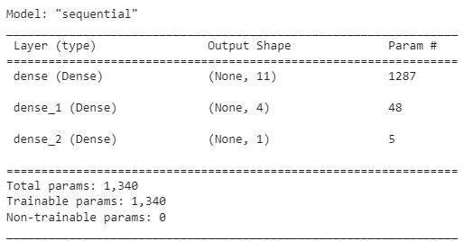
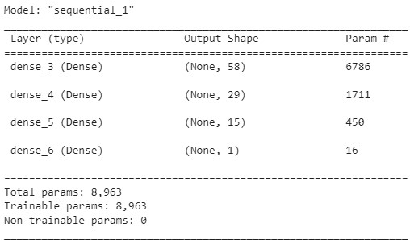
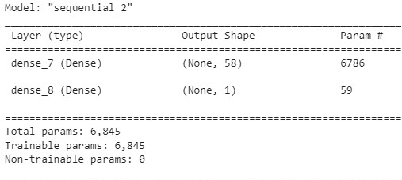

# Module-13

# Step 1: Prepare the data
* Using google Colab I imported the libraies I required mainly using `TensorFlow` and `Keras` to make the models for the data.
* I uploaded the csv and pulled it from the Resources folder, converted it to a DataFrame and droped the non relevant columns to binary classification
* Using `OneHotEncoder` I encoded a list of the categorical variables from the DataFrame, and then a list of the non-categorical variables
* Split the data into tain and test data using `train_test_split` setting the features(X) and the target(y), with the target being "IS_SUCCESSFUL" column in the DataFrame
* Scaled the features data using `StandardScaler`

# Step 2: Complie and Evaluate the model
* Found the number of columns listed in X with len(X.columns) and used that for the input features
* Set the number of output neurons to 1
* Then found the ceiling and square root of the input multiplied by the output and got 11 for our first hidden node layer
* To find the second layer used the same method but used the hidden layer 1 and the output
* Created the sequential model using `Sequential()`
* Added the layers and printed the summary

  
  * Compiled the model using `binary_crossentropy` as the loss function, `adam` as the optimizer and `accuracy` as the evaluation metric
  * Fit the model using the scaled X_train and the y train and ran at 50 epochs
  * `Original Model Results 268/268 - 0s - loss: 0.5558 - accuracy: 0.7272 - 438ms/epoch - 2ms/step
    Loss: 0.5558086633682251, Accuracy: 0.7272303104400635`
  * saved the model as HDF5 file and named it [`Alphabetsoup.h5`](https://github.com/ScottyCodeman/Module-13/blob/a037bca9e96ba08fcd3ee03f22fdedad2cd5d464/Resources/AlphabetSoup.h5)
# Step 3: Optimize the model
* Keeping the number features and the output layer the same. The Alternative Model 1 was started with the attempt to increase the layers and the nodes at each layer, thus increaseing the params

   
* Fit the model using the same data and ran this at 50 epochs aswell
* `Alternative Model 1 Results
268/268 - 1s - loss: 0.5547 - accuracy: 0.7287 - 1s/epoch - 5ms/step
Loss: 0.5547082424163818, Accuracy: 0.7287463545799255`

* Alternative model 2 i decided to keep things a little more simple, less layers and increased the batch size to 250 from the default

    

*`Alternative Model 2 Results
268/268 - 0s - loss: 0.5567 - accuracy: 0.7317 - 491ms/epoch - 2ms/step
Loss: 0.5566757917404175, Accuracy: 0.7316617965698242`

* saved both of the models as HDF5 file:
*  Alternative model 1[`AlphabetSoup_A1.h5`](https://github.com/ScottyCodeman/Module-13/blob/c4fc30cc210be9262581530256ea2cd64859ef21/Resources/AlphabetSoup_A1.h5)
*  Alternative model 2[`AlphabetSoup_A2.h5`](https://github.com/ScottyCodeman/Module-13/blob/c4fc30cc210be9262581530256ea2cd64859ef21/Resources/AlphabetSoup_A2.h5)
  
